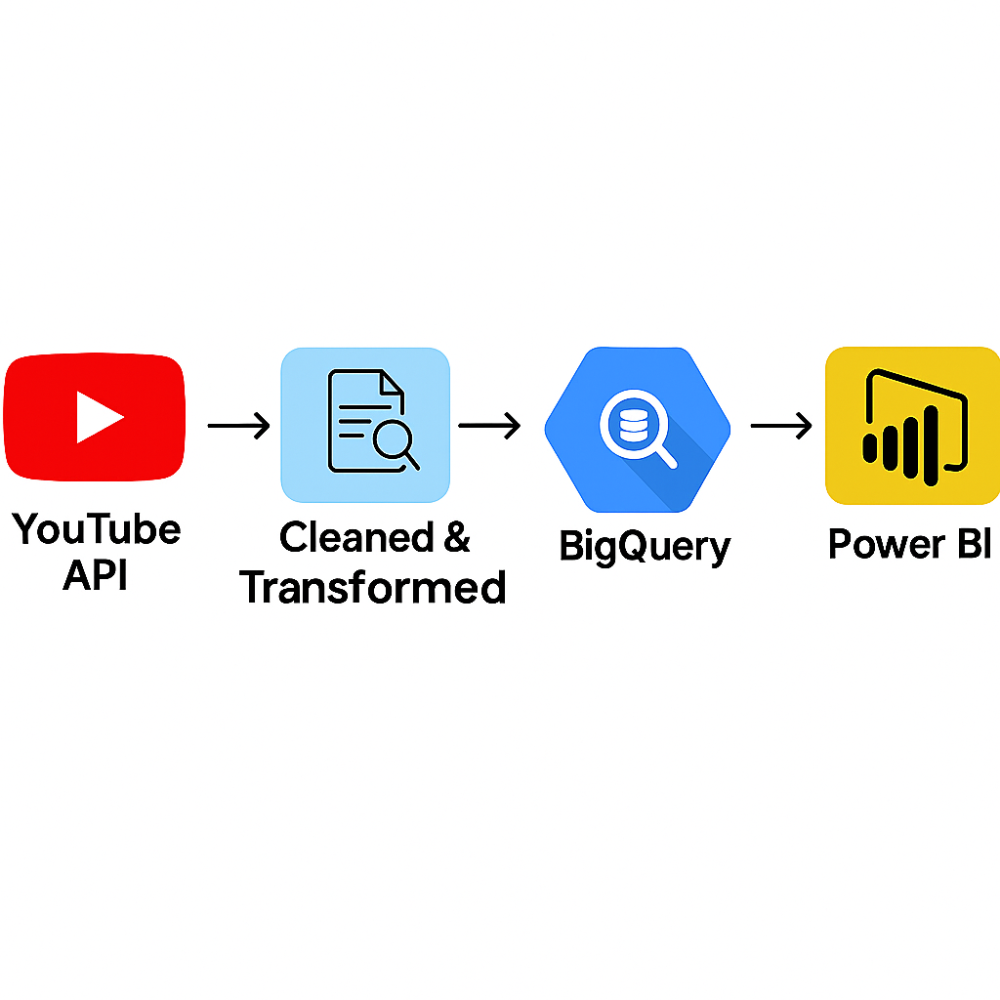

# 📺 YouTube Data Extraction & Analytics

This project extracts channel, playlist, and video-level statistics from the YouTube Data API v3, saves the data locally, and loads it into Google BigQuery for analysis and dashboarding in Power BI.



---

## 🔧 Features
- Connects to YouTube Data API using API key
- Extracts channel info (name, subscribers, join date, country, etc.)
- Extracts all playlists and their videos
- Saves data as CSV files in the `/data` directory
- Does data transformation
- Loads transformed data into BigQuery (channel, playlist, video tables)
- Ready for reporting with Power BI

---

## 📁 Project Structure
```
├── credentials/                # GCP service account key (.json)
├── data/                       # Raw and cleaned CSV data
├── scripts/
│   ├── google_api.py           # API connection
│   ├── extract_data.py         # Fetch data from YouTube
│   ├── constants.py            # Contains constant variables
│   ├── load_data.py            # Upload to BigQuery
│   └── main.py                 # Runs full pipeline
├── .env                        # Stores YOUTUBE_API_KEY
├── projectflow.txt             # Detailed step-by-step setup
└── README.md                   # Project overview
```

---

## 🚀 Quickstart
1. Set up `.env` with your YouTube API key
2. Configure BigQuery and service account (see `projectflow.txt`)
3. Activate environment:
```bash
conda activate youtube_analytics
```
4. Run the full ETL pipeline:
```bash
python -m scripts.main
```

---

## 📊 Output
- `channel_data.csv`, `playlist_data.csv`, `video_data.csv` in `/data`
- BigQuery tables: `channel_data`, `playlist_data`, `video_data` under dataset `youtube_data`
- Ready for visualization using Power BI

---

## 🔮 Future Enhancements
- Automate pipeline using `cron` or `Apache Airflow`
- Enable incremental data loads to BigQuery
- Add alerting/monitoring for API limits or job failures
- Store raw files in Google Cloud Storage
- Implement data validation checks before loading
- Use dbt for transformations in BigQuery
- Deploy Power BI dashboard refresh via scheduled gateway

---

## ✅ Done!
Data pipeline is complete. You can now build reports using Power BI connected to BigQuery.

🎉 Happy analyzing!